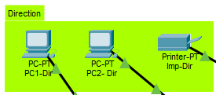
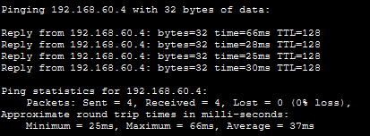

# Réseau complexe — VLANs, routage inter-sites et sécurisation Cisco


Projet réalisé sous **Cisco Packet Tracer**, construit progressivement : adressage IP d'un réseau multi-services, puis ajout du WiFi, sécurisation des équipements, VPN vers un site distant, et enfin segmentation en VLANs avec routage inter-VLAN.

## Sommaire

- [I. Topologie du réseau](#i-topologie-du-réseau)
- [II. Plan d'adressage](#ii-plan-dadressage)
- [III. Ajout d'un point d'accès WiFi](#iii-ajout-dun-point-daccès-wifi)
- [IV. Rappels : commutation de couche 2](#iv-rappels--commutation-de-couche-2)
- [V. Accès à distance sécurisé (SSH)](#v-accès-à-distance-sécurisé-ssh)
- [VI. Interconnexion avec un site distant (VPN)](#vi-interconnexion-avec-un-site-distant-vpn)
- [VII. Routage](#vii-routage)
- [VIII. Segmentation en VLANs](#viii-segmentation-en-vlans)
- [IX. Routage inter-VLAN (SVI)](#ix-routage-inter-vlan-svi)
- [X. Vérifications](#x-vérifications)
- [XI. Sauvegarde des configurations](#xi-sauvegarde-des-configurations)

---

## I. Topologie du réseau

Le scénario est celui d'une administration composée de plusieurs services, chacun avec 2 PC et une imprimante réseau : **Direction, Examens, Paie, Emploi, Médecine, Assurance, Informatique**, plus une **salle serveur** (AD, applicatif, fichiers) et un **routeur** faisant la jonction avec Internet.

**Matériel utilisé :**

| Rôle | Modèle | Débit |
|---|---|---|
| Commutateurs de service (1 à 3) | Cisco 2960 | FastEthernet 100 Mb/s + 1 port Gigabit |
| Cœur de réseau (commutateur 4) | Cisco 3650 | Gigabit, niveau 3 (routage possible) |
| Routeur | Cisco 1941 | Gigabit |

Chaque service est relié à un commutateur d'accès (2960), lui-même relié au **cœur de réseau** (3650), qui centralise tout et est connecté au routeur pointant vers Internet.

**Convention de nommage des interfaces :**

| Équipement | Format des ports | Numérotation |
|---|---|---|
| Routeur | `g0/0`, `g0/1` | à partir de 0 |
| Commutateur d'accès | `f0/1` à `f0/24`, `g0/1`, `g0/2` | à partir de 1 |
| Cœur de réseau (niveau 3) | `g1/0/1` à `g1/0/24`, `g1/1/1` à `g1/1/4` | — |


---

## II. Plan d'adressage

Chaque service dispose de son propre sous-réseau en `/24` :

| Groupe | Réseau | Passerelle |
|---|---|---|
| Direction | 192.168.20.0/24 | .254 |
| Examen | 192.168.21.0/24 | .254 |
| Paie | 192.168.22.0/24 | .254 |
| Emploi | 192.168.23.0/24 | .254 |
| Médecine | 192.168.24.0/24 | .254 |
| Assurance | 192.168.25.0/24 | .254 |
| Informatique | 192.168.27.0/24 | .254 |
| Serveurs | 192.168.30.0/24 | .254 |
| Impression | 192.168.40.0/24 | .254 |

Les 2 PC de chaque service prennent les premières adresses du réseau (`.1`, `.2`), l'imprimante et les serveurs sont regroupés respectivement dans les réseaux `.40` et `.30`, avec un dernier octet identifiant le service (ex : `192.168.40.1` = imprimante Direction, `192.168.40.5` = imprimante Médecine).

> [!TIP]
> Exemple pour les deux premiers PC et l'imprimante de la direction (à appliquer sur tous les postes).

| PC | Service | VLAN | Adresse IP | Masque | Passerelle |
|---|---|---:|---|---|---|
| PC1-Dir | Direction | 20 | `192.168.20.1` | `255.255.255.0` | `192.168.20.254` |
| PC2-Dir | Direction | 20 | `192.168.20.2` | `255.255.255.0` | `192.168.20.254` |
| IMP-Dir | Direction | 40 | `192.168.40.1` | `255.255.255.0` | `192.168.40.254` |



---

## III. Ajout d'un point d'accès WiFi

Un point d'accès **AP-PT** (niveau 2) est raccordé au cœur de réseau, sur un nouveau sous-réseau dédié `192.168.60.0/24`.

| Périphérique de test | Adresse |
|---|---|
| Laptop | 192.168.60.1 |
| TV | 192.168.60.2 |
| Tablette | 192.168.60.3 |
| Smartphone | 192.168.60.4 |
| Webcam | 192.168.60.5 |

**Paramètres du point d'accès :**

| SSID | Sécurité | Mot de passe |
|---|---|---|
| Metropole | WPA2-PSK | `1234-Metropole:1234` |


>[!TIP]
>Test de ping réussi du laptop vers le smartphone.



---

## IV. Rappels : commutation de couche 2

Un commutateur maintient une **table d'adresses MAC** (mémoire CAM — *Content Addressable Memory*) qui associe chaque adresse MAC à un port. Une trame ne ressort jamais par le port par lequel elle est entrée.

**Méthode "Switch Learn and Forward" :**

1. **Mode découverte (apprentissage)** : le commutateur lit l'adresse MAC source de la trame entrante et l'associe au port d'entrée dans sa table (avec un compteur d'obsolescence, 5 min par défaut).
2. **Mode transfert** : le commutateur lit l'adresse MAC de destination.
   - Si elle est connue dans la table → transfert uniquement sur le port correspondant.
   - Si elle est inconnue, ou s'il s'agit d'une trame de diffusion (broadcast) → transfert sur tous les ports, sauf le port d'entrée.

> ⚠️ Un port peut être associé à plusieurs adresses MAC (cas d'un switch en cascade), mais l'inverse n'est jamais vrai.

```
Switch> show mac-address-table
```
> [!NOTE]
> **Schéma "Switch Learn and Forward"**: 


**Évolution de la table MAC avant et après un test de ping**

*Avant Ping*

*Après Ping*

[!NOTE]
La table MAC d'un commutateur change dynamiquement au fil du trafic et du temps, reflétant l'activité en temps réel de ses ports.


                         
> 2. Un `show mac-address-table` avant/après un ping entre deux PC du même service, pour montrer le remplissage de la table.

[!NOTE]
La table MAC d'un commutateur change en temps réel grâce au mécanisme Learn and Forward : le switch apprend dynamiquement les adresses MAC source des tranches qui traversent ses ports et les supprime automatiquement après une période d'inactivité (vieillissement).

### Rappel CLI Cisco IOS

| Mode | Invite | Commande pour y accéder |
|---|---|---|
| Utilisateur (lecture seule) | `>` | — |
| Exécution privilégié | `#` | `enable` |
| Configuration globale | `(config)#` | `configure terminal` |

---

## V. Accès à distance sécurisé (SSH)

Par défaut, un commutateur de couche 2 n'a pas d'adresse IP propre : il est administré via une interface virtuelle **SVI**, rattachée par défaut au VLAN 1. Par sécurité, on utilise un VLAN dédié à l'administration plutôt que le VLAN 1.

| Groupe | VLAN | Réseau | Passerelle |
|---|---|---|---|
| Administration | 100 | 192.168.100.0/24 | 192.168.100.254 |

**Configuration de l'interface VLAN d'administration (exemple sur le switch `Dir-Exam`) :**

```
Switch(config)# hostname Dir-Exam
Dir-Exam(config)# interface vlan 100
Dir-Exam(config-if)# ip address 192.168.100.2 255.255.255.0
Dir-Exam(config-if)# ipv6 address 2001:db8:acad:100::2/64
Dir-Exam(config-if)# no shutdown
Dir-Exam(config-if)# ip default-gateway 192.168.100.254
```

> ⚠️ Le SVI n'apparaît "up" que lorsqu'au moins un port est actif dans le VLAN 100.

**Activation du SSH (Telnet proscrit) :**

```
Dir-Exam# show version                      ! vérifier que l'IOS contient "K9" (support crypto)
Dir-Exam(config)# enable secret 1234-MetroPole:1234
Dir-Exam(config)# ip domain-name metro.com
Dir-Exam(config)# crypto key generate rsa    ! 1024 bits
Dir-Exam(config)# ip ssh version 2
Dir-Exam(config)# username admin secret 1234-MetroPole:1234
Dir-Exam(config)# line vty 0 15
Dir-Exam(config-line)# transport input ssh
Dir-Exam(config-line)# login local
```

**Connexion depuis un poste client :**

```
ssh admin@192.168.100.2
```

> 📸 **Capture à insérer ici** : le terminal (CMD ou PuTTY) montrant la connexion SSH réussie vers le switch.

---

## VI. Interconnexion avec un site distant (VPN)

**Objectif** : relier le site principal (Métropole) à un site distant via Internet, en **VPN IPsec**.

**Composition du site distant :**

| Équipement | Modèle |
|---|---|
| Routeur distant | Cisco 1941 (avec carte **HWIC-2T** ajoutée pour la liaison série) |
| Commutateur | Cisco Catalyst 2960 |
| Terminaux | 2 PC + 1 imprimante réseau |

**Plan d'adressage du site distant :**

| PC1-VPN | PC2-VPN | IMP-VPN | Passerelle |
|---|---|---|---|
| 192.168.110.1 | 192.168.110.2 | 192.168.110.3 | 192.168.110.254 |

> 📸 **Captures à insérer ici** :
> 1. Le schéma manuscrit "Métropole ↔ lien VPN IPsec (liaison série) ↔ Site distant".
> 2. L'ajout de la carte HWIC-2T dans le routeur (vue physique Packet Tracer).
> 3. La topologie Packet Tracer du site distant (switch 2960 + PC1/PC2/IMP-VPN + routeur).

### Sécurisation du routeur distant

```
Router(config)# hostname RouteurVPN
RouteurVPN(config)# enable secret 1234-MetroPole:1234
RouteurVPN(config)# ip domain-name metropolecg.com
RouteurVPN(config)# username admin secret 1234-MetroPole:1234
RouteurVPN(config)# crypto key generate rsa        ! 1024 bits
RouteurVPN(config)# ip ssh version 2

RouteurVPN(config)# line console 0
RouteurVPN(config-line)# password 1234-MetroPole:1234
RouteurVPN(config-line)# login
RouteurVPN(config-line)# exit

RouteurVPN(config)# line vty 0 15
RouteurVPN(config-line)# login local
RouteurVPN(config-line)# transport input ssh
RouteurVPN(config-line)# exit

RouteurVPN(config)# service password-encryption
RouteurVPN(config)# banner motd % Accès aux personnes autorisées seulement %

RouteurVPN# copy running-config startup-config
```

*(Même procédure appliquée au routeur principal de la Métropole.)*

Les 8 points de sécurisation systématiques d'un routeur :

1. Nom de l'hôte
2. Mot de passe du mode privilégié
3. Configuration SSH (utilisateur admin + nom de domaine)
4. Mot de passe sur l'accès console
5. Mot de passe VTY pour l'accès SSH
6. Chiffrement des mots de passe (`service password-encryption`)
7. Bannière légale d'accès non autorisé
8. Sauvegarde de la configuration (`copy running-config startup-config`)

### Configuration des interfaces

```
RouteurVPN(config)# interface GigabitEthernet 0/0
RouteurVPN(config-if)# ip address 192.168.110.254 255.255.255.0
RouteurVPN(config-if)# ipv6 address 2001:db8:acad:110::254/64
RouteurVPN(config-if)# description Lien Sous-Reseau VPN
RouteurVPN(config-if)# no shutdown
RouteurVPN(config-if)# exit

RouteurVPN(config)# interface Serial 0/1/1
RouteurVPN(config-if)# ip address 10.0.0.2 255.255.255.0
RouteurVPN(config-if)# description Lien RouteurVPN - Routeur Metro
RouteurVPN(config-if)# no shutdown
RouteurVPN(config-if)# exit

RouteurVPN(config)# interface loopback 0
RouteurVPN(config-if)# ip address 192.168.200.2 255.255.255.0
```

> 📸 **Capture à insérer ici** : le schéma manuscrit avec les adresses des interfaces (`192.168.100.254` / `10.0.0.1` / `10.0.0.2` / `192.168.110.254`) entre Routeur Métro et Routeur VPN.

---

## VII. Routage

Le routeur choisit toujours la route au **préfixe le plus long** (masque le plus précis) pour atteindre une destination.

**Sur le routeur distant, route par défaut vers Internet :**

```
RouteurVPN(config)# ip route 0.0.0.0 0.0.0.0 10.0.0.1
```

**Sur le routeur Métropole, route vers le site distant + route par défaut :**

```
RouteurMetro(config)# ip route 192.168.110.0 255.255.255.0 10.0.0.2
RouteurMetro(config)# ip route 0.0.0.0 0.0.0.0 192.168.10.2
```

Le cœur de réseau (niveau 3) a lui aussi besoin d'une table de routage :

```
Switch(config)# hostname SwitchL3
SwitchL3(config)# interface g1/0/1
SwitchL3(config-if)# no switchport
SwitchL3(config-if)# ip address 192.168.10.2 255.255.255.0
SwitchL3(config-if)# exit
SwitchL3(config)# ip routing
SwitchL3(config)# ip route 0.0.0.0 0.0.0.0 192.168.10.1
```

---

## VIII. Segmentation en VLANs

### Pourquoi des VLANs ?

- **Domaine de collision** : se produit quand 2 trames sont émises en même temps sur un même segment ; plus il est petit, meilleur est le réseau (les commutateurs modernes le limitent déjà nativement, port par port).
- **Domaine de diffusion** : une trame broadcast reçue sur un port est retransmise sur tous les autres ports du commutateur. Sur un réseau plat de la taille de la Métropole, ce domaine devient trop grand et congestionne le réseau.
- Séparer chaque service par un routeur physique serait trop coûteux → on utilise des **VLANs** pour créer plusieurs réseaux logiques sur une infrastructure physique commune, réduisant ainsi les domaines de diffusion.

### Plan des VLANs

| Groupe | VLAN | Réseau |
|---|---|---|
| Direction | 20 | 192.168.20.0/24 |
| Examen | 21 | 192.168.21.0/24 |
| Paie | 22 | 192.168.22.0/24 |
| Emploi | 23 | 192.168.23.0/24 |
| Médecine | 24 | 192.168.24.0/24 |
| Assurance | 25 | 192.168.25.0/24 |
| VPN | 26 | — |
| Informatique | 27 | 192.168.27.0/24 |
| Serveurs | 30 | 192.168.30.0/24 |
| Impression | 40 | 192.168.40.0/24 |
| Téléphonie | 50 | — |
| WiFi | 60 | 192.168.60.0/24 |
| Administration | 100 | 192.168.100.0/24 |

Chaque commutateur d'accès ne reçoit que les VLANs dont il a besoin (par exemple `Dir-Exam` : VLANs 20, 21, 40, 50, 100).

**Création des VLANs (exemple sur `Dir-Exam`) :**

```
Dir-Exam(config)# vlan 20
Dir-Exam(config-vlan)# name Direction
Dir-Exam(config-vlan)# vlan 21
Dir-Exam(config-vlan)# name Examen
Dir-Exam(config-vlan)# vlan 40
Dir-Exam(config-vlan)# name Impression
Dir-Exam(config-vlan)# vlan 50
Dir-Exam(config-vlan)# name Telephonie
Dir-Exam(config-vlan)# vlan 100
Dir-Exam(config-vlan)# name Administration
Dir-Exam(config-vlan)# end
Dir-Exam# write memory
```

**Affectation d'un VLAN à un port :**

```
Dir-Exam(config)# interface fa0/1
Dir-Exam(config-if)# switchport mode access
Dir-Exam(config-if)# switchport access vlan 20
```

> 📸 **Capture à insérer ici** : `show vlan brief` sur le switch `Dir-Exam`, montrant les VLANs 20/21/40/50/100 actifs avec leurs ports respectifs.

**Commandes utiles pour la gestion des VLANs :**

```
show vlan brief                          ! lister les VLANs
switchport access vlan <id>              ! changer le VLAN d'un port
no switchport access vlan                ! retirer un port d'un VLAN
no vlan <id>                             ! supprimer un VLAN du switch
delete vlan.dat                          ! supprimer tous les VLANs (+ redémarrage)
erase startup-config                     ! réinitialiser un switch aux paramètres d'usine
```

### Trunk inter-commutateurs

Un **trunk** est un lien de couche 2 entre deux commutateurs qui achemine le trafic de tous les VLANs autorisés.

```
Dir-Exam(config)# interface g0/1
Dir-Exam(config-if)# switchport mode trunk
Dir-Exam(config-if)# switchport trunk native vlan 100
Dir-Exam(config-if)# switchport trunk allowed vlan 20,21,40,50,100
```

*(À adapter pour chaque switch selon les VLANs qu'il porte : `Paie-Emp` → 22,23,40,50,100 ; `Med-Assu` → 24,25,40,50,100 ; `Info` → 27,40,50,100.)*

### VLAN voix (téléphonie IP)

Contraintes propres à la VOIP : bande passante garantie, priorité de transmission sur les autres VLANs, latence < 150 ms sur tout le réseau. Un port peut porter à la fois un VLAN données et un VLAN voix (cas particulier, uniquement pour la voix) :

```
Dir-Exam(config)# interface fa0/1
Dir-Exam(config-if)# mls qos trust cos
Dir-Exam(config-if)# switchport voice vlan 50
```

---

## IX. Routage inter-VLAN (SVI)

Le cœur de réseau (niveau 3) porte une **interface virtuelle (SVI)** par VLAN, qui sert de passerelle à chaque sous-réseau.

**Sur le cœur de réseau (`SwitchL3`) : déclaration des VLANs, puis des trunks vers chaque switch d'accès :**

```
SwitchL3(config)# vlan 20
SwitchL3(config-vlan)# name Direction
! ... répéter pour chaque VLAN (21, 22, 23, 24, 25, 27, 30, 40, 50, 60, 100)

SwitchL3(config)# interface g1/0/1                 ! vers Dir-Exam
SwitchL3(config-if)# switchport mode trunk
SwitchL3(config-if)# switchport trunk native vlan 100
SwitchL3(config-if)# switchport trunk allowed vlan 20,21,40,50,100

SwitchL3(config)# interface range g1/0/5-7          ! serveurs, en accès direct
SwitchL3(config-if)# switchport mode access
SwitchL3(config-if)# switchport access vlan 30
```

**Création des SVI (une par VLAN, exemple pour Direction et Serveurs) :**

```
SwitchL3(config)# interface vlan 20
SwitchL3(config-if)# description Passerelle SVI Direction
SwitchL3(config-if)# ip address 192.168.20.254 255.255.255.0
SwitchL3(config-if)# ipv6 address 2001:db8:acad:20::254/64
SwitchL3(config-if)# no shutdown

SwitchL3(config)# interface vlan 30
SwitchL3(config-if)# description Passerelle SVI Serveurs
SwitchL3(config-if)# ip address 192.168.30.254 255.255.255.0
SwitchL3(config-if)# ipv6 address 2001:db8:acad:30::254/64
SwitchL3(config-if)# no shutdown
```

*(Même procédure pour les VLANs 21, 22, 23, 24, 25, 27, 40, 60, 100.)*

---

## X. Vérifications

```
show ip interface brief
show ip route
show vlan brief
show interfaces fa0/1 switchport
```

**Tests de connectivité effectués depuis le routeur VPN (site distant) :**

```
ping 192.168.110.1     ! PC1-VPN (local)
ping 192.168.110.254   ! passerelle locale
ping 10.0.0.2           ! interface série locale
ping 10.0.0.1           ! interface série Métropole
ping 192.168.10.1       ! cœur de réseau (côté routeur)
ping 192.168.10.2       ! cœur de réseau (interface routée)
```

**Tests de connectivité inter-VLAN (depuis un PC vers sa passerelle SVI) :** réalisés avec succès depuis PC1-Dir (VLAN 20), le PC admin (VLAN 100) et PC2-Assurance (VLAN 25).

> 📸 **Captures à insérer ici** :
> 1. Ping réussi depuis PC1-Dir vers `192.168.20.254`.
> 2. Ping réussi depuis le PC admin vers `192.168.100.254`.
> 3. Ping réussi depuis PC2-Assurance vers `192.168.25.254`.

---

## XI. Sauvegarde des configurations

Sur un routeur, la configuration active (RAM) n'est jamais persistée automatiquement : si l'équipement redémarre sans sauvegarde, tout le travail est perdu.

### Explorer le système de fichiers

```
Router# show file systems
```

Cette commande renvoie, pour chaque support de stockage : sa taille, son type de système de fichiers et les autorisations associées.

| Symbole | Signification |
|---|---|
| `*` | Système de fichiers par défaut |
| `#` | Disque amorçable |

Le routeur reconnaît aussi quelques commandes façon DOS pour naviguer dans ses fichiers : `dir`, `cd`, `copy`.

### Sauvegarder la configuration en cours

La configuration active (`running-config`, en RAM) doit être copiée vers la configuration de démarrage (`startup-config`, en NVRAM) pour survivre à un redémarrage :

```
RouteurMetro# copy running-config startup-config
Destination filename [startup-config]?
Building configuration...
[OK]
```

### Recharger la configuration initiale

À l'inverse, pour revenir à la dernière configuration sauvegardée (annuler des changements non enregistrés) :

```
RouteurMetro# copy startup-config running-config
Destination filename [running-config]?
```

> 💡 Dans Packet Tracer, ces commandes s'exécutent depuis l'onglet **CLI** de l'équipement (mêmes commandes qu'en conditions réelles).

> 📸 **Capture à insérer ici** : le `show file systems` du routeur (taille flash/NVRAM) et le résultat du `copy running-config startup-config` (`[OK]`).
