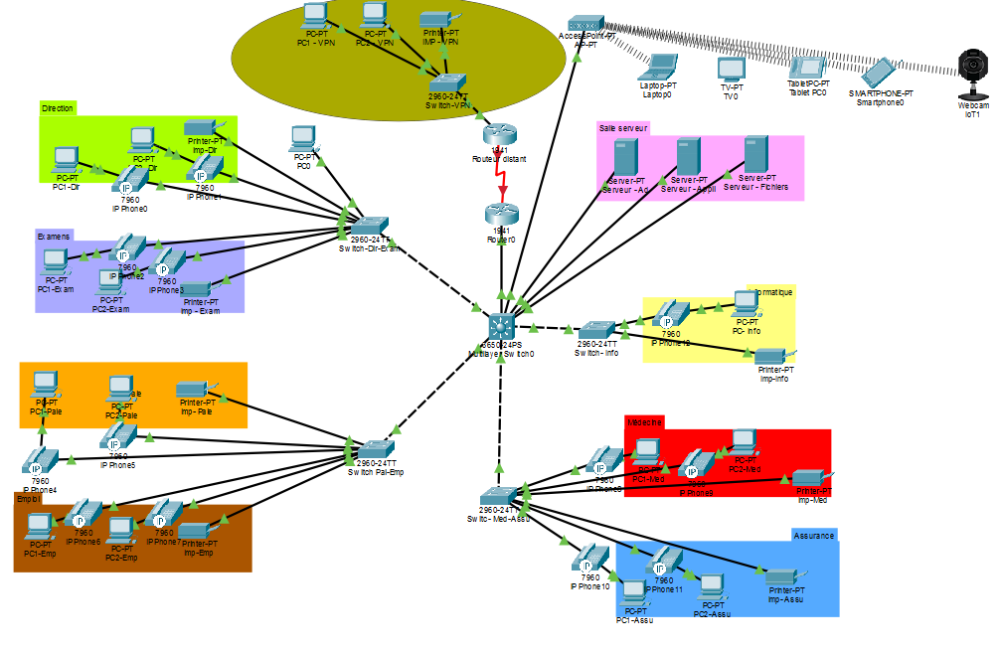
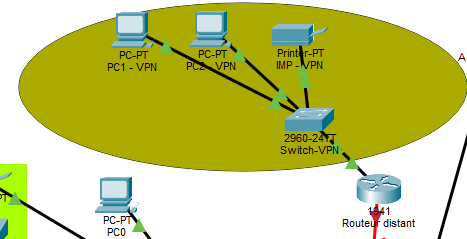
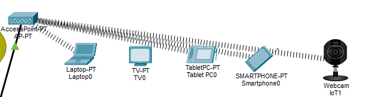

# 🌐 Réseau complexe — Infrastructure Cisco

## 📌 Présentation

Ce projet consiste à concevoir et configurer une **infrastructure réseau complète sous Cisco Packet Tracer** pour une administration composée de plusieurs services.

L'infrastructure intègre plusieurs réseaux dédiés aux différents services, un réseau Wi-Fi, un réseau d'administration, des serveurs ainsi qu'un **site distant interconnecté**.

Le projet permet de mettre en pratique différentes notions de **réseaux, routage, commutation, segmentation et sécurité**.

> [!NOTE]
> Schéma finale

---

## Architecture

L'infrastructure repose sur :

- des **switchs Cisco 2960** pour les réseaux d'accès ;
- un **switch Cisco 3650** utilisé comme cœur de réseau et pour le routage de niveau 3 ;
- des **routeurs Cisco 1941** pour le routage et l'interconnexion des sites ;
- un **point d'accès Wi-Fi** ;
- différents équipements clients : PC, imprimantes, serveurs et périphériques mobiles.

Les différents services sont séparés logiquement afin de construire une infrastructure organisée et évolutive.

---

## Segmentation réseau

Chaque service dispose de son propre **VLAN et sous-réseau IP**.

| VLAN | Service |
|---:|---|
| 20 | Direction |
| 21 | Examen |
| 22 | Paie |
| 23 | Emploi |
| 24 | Médecine |
| 25 | Assurance |
| 27 | Informatique |
| 30 | Serveurs |
| 40 | Impression |
| 50 | Téléphonie |
| 60 | Wi-Fi |
| 100 | Administration |

Cette segmentation permet de limiter les domaines de diffusion et de séparer les différents services au sein de l'infrastructure.

---

## Interconnexion des sites

Le projet comprend également un **site distant** composé d'un routeur, d'un switch et de plusieurs équipements utilisateurs.

La communication entre le site principal et le site distant repose sur une interconnexion entre routeurs avec mise en œuvre du **routage** et d'un **VPN IPsec**.

---

## Sécurisation

La sécurité des équipements réseau fait également partie du projet.

L'administration distante est réalisée avec **SSH**, avec notamment :

- authentification locale ;
- clés RSA ;
- SSH version 2 ;
- sécurisation des accès console et VTY ;
- chiffrement des mots de passe ;
- bannière d'accès ;
- VLAN d'administration dédié.

---

## Wi-Fi

Un réseau Wi-Fi dédié est intégré à l'infrastructure afin de permettre la connexion de différents périphériques.

Le réseau utilise un **point d'accès AP-PT** et une sécurité **WPA2-PSK**.

---

## Tests et validation

Une série de tests permet de vérifier le bon fonctionnement de l'infrastructure :

- vérification des interfaces ;
- vérification des VLANs ;
- vérification des tables de routage ;
- vérification des tables MAC ;
- tests de connectivité avec `ping` ;
- tests du routage inter-VLAN ;
- tests de communication avec le site distant.

---

## Technologies utilisées

- **Cisco Packet Tracer**
- **Cisco IOS**
- **VLAN**
- **802.1Q / Trunk**
- **Routage inter-VLAN (SVI)**
- **Routage statique**
- **SSH**
- **VPN IPsec**
- **IPv4 / IPv6**
- **Wi-Fi / WPA2**

---

## Objectifs pédagogiques

Ce projet permet de développer des compétences dans :

- la conception d'une architecture réseau ;
- l'adressage et le découpage en sous-réseaux ;
- la configuration de switchs et routeurs Cisco ;
- la segmentation avec les VLANs ;
- le routage inter-VLAN ;
- l'interconnexion de réseaux distants ;
- la sécurisation des équipements ;
- le diagnostic et la validation d'une infrastructure réseau.

---

## 📖 Documentation

La **procédure complète** du projet est disponible dans :

➡️ [`PROCEDURE.md`](PROCEDURE.md)

Elle détaille les différentes étapes de configuration ainsi que les commandes Cisco utilisées.

---

## 👩‍💻 Projet

Projet réalisé dans le cadre de ma formation en **BTS SIO – option SISR**, avec pour objectif de mettre en pratique les connaissances acquises en **infrastructure réseau, administration Cisco et cybersécurité**.
