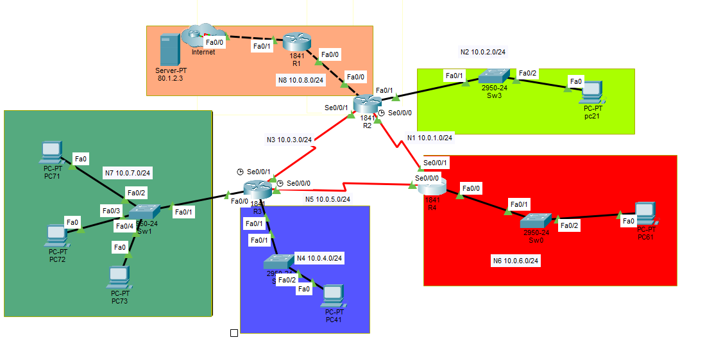
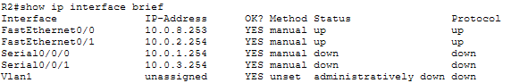
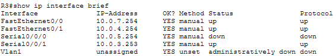
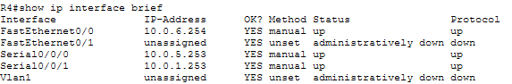
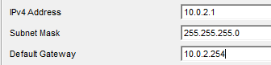
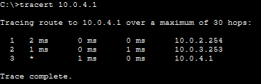
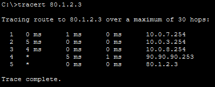
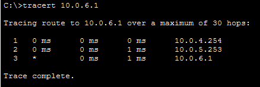

# Configuration-et-Routage-Statique-Multi-Routeurs : 


 
## Partie 1 — Configuration des interfaces des routeurs
 
### Objectif
 
Configurer les adresses IP des interfaces des routeurs conformément au schéma réseau et activer ces interfaces.  
Les adresses des routeurs sont choisies **les plus grandes possibles** dans chaque réseau, attribuées dans l'ordre R2, R3, puis R4.  
> R1 est déjà configuré avec l'adresse IP `10.0.8.254`.
 
---
 
### Schéma du réseau
 

 
---
 
### Plan d'adressage des routeurs
 
| Routeur | Interface    | Réseau | Adresse IP    | Masque          |
|---------|-------------|--------|---------------|-----------------|
| R2      | Fa0/0       | N8     | 10.0.8.253    | 255.255.255.0   |
| R2      | Fa0/1       | N2     | 10.0.2.254    | 255.255.255.0   |
| R2      | Se0/0/0     | N1     | 10.0.1.254    | 255.255.255.0   |
| R2      | Se0/0/1     | N3     | 10.0.3.254    | 255.255.255.0   |
| R3      | Fa0/0       | N7     | 10.0.7.254    | 255.255.255.0   |
| R3      | Fa0/1       | N4     | 10.0.4.254    | 255.255.255.0   |
| R3      | Se0/0/0     | N5     | 10.0.5.254    | 255.255.255.0   |
| R3      | Se0/0/1     | N3     | 10.0.3.253    | 255.255.255.0   |
| R4      | Fa0/0       | N6     | 10.0.6.254    | 255.255.255.0   |
| R4      | Se0/0/0     | N5     | 10.0.5.253    | 255.255.255.0   |
| R4      | Se0/0/1     | N1     | 10.0.1.253    | 255.255.255.0   |
 
---
 
### Configuration du routeur R2
 
```
enable
configure terminal
 
# Interface vers R1 (N8)
interface FastEthernet0/0
 ip address 10.0.8.253 255.255.255.0
 no shutdown
 
# Interface LAN (N2)
interface FastEthernet0/1
 ip address 10.0.2.254 255.255.255.0
 no shutdown
 
# Interface vers R4 (N1)
interface Serial0/0/0
 ip address 10.0.1.254 255.255.255.0
 no shutdown
 
# Interface vers R3 (N3)
interface Serial0/0/1
 ip address 10.0.3.254 255.255.255.0
 no shutdown
```
 
> ⚠️ **Remarque :** Packet Tracer renomme automatiquement les interfaces `Se0/0/x` en `Serial10/0/x` dans les messages de log système, en raison de l'emplacement physique des modules d'extension sur le routeur 1841. Malgré le `no shutdown`, les interfaces série restent en état **down** tant que les routeurs voisins ne sont pas encore configurés.
 
#### Vérification — `show ip interface brief` sur R2
 

 
| Interface       | IP-Address  | Status | Protocol |
|----------------|-------------|--------|----------|
| FastEthernet0/0 | 10.0.8.253 | up     | up       |
| FastEthernet0/1 | 10.0.2.254 | up     | up       |
| Serial0/0/0     | 10.0.1.254 | down   | down     |
| Serial0/0/1     | 10.0.3.254 | down   | down     |
 
Les interfaces Ethernet sont déjà opérationnelles (up/up) car connectées à des équipements actifs. Les interfaces série vers R4 (N1) et R3 (N3) sont en **down/down** : cet état est normal, elles s'activeront dès que les routeurs voisins seront configurés.
 
---
 
### Configuration du routeur R3
 
```
enable
configure terminal
 
# Interface LAN (N7)
interface FastEthernet0/0
 ip address 10.0.7.254 255.255.255.0
 no shutdown
 
# Interface LAN (N4)
interface FastEthernet0/1
 ip address 10.0.4.254 255.255.255.0
 no shutdown
 
# Interface vers R4 (N5)
interface Serial0/0/0
 ip address 10.0.5.254 255.255.255.0
 no shutdown
 
# Interface vers R2 (N3)
interface Serial0/0/1
 ip address 10.0.3.253 255.255.255.0
 no shutdown
```
 
#### Vérification — `show ip interface brief` sur R3
 

 
| Interface       | IP-Address  | Status | Protocol |
|----------------|-------------|--------|----------|
| FastEthernet0/0 | 10.0.7.254 | up     | up       |
| FastEthernet0/1 | 10.0.4.254 | up     | up       |
| Serial0/0/0     | 10.0.5.254 | down   | down     |
| Serial0/0/1     | 10.0.3.253 | up     | up       |
 
Les interfaces LAN sont up/up. La liaison série avec R2 (Se0/0/1) est **up/up**, ce qui confirme que le câble série entre R2 et R3 est fonctionnel. L'interface vers R4 (Se0/0/0) reste down car R4 n'est pas encore configuré à ce stade.
 
---
 
### Configuration du routeur R4
 
```
enable
configure terminal
 
# Interface LAN (N6)
interface FastEthernet0/0
 ip address 10.0.6.254 255.255.255.0
 no shutdown
 
# Interface vers R3 (N5)
interface Serial0/0/0
 ip address 10.0.5.253 255.255.255.0
 no shutdown
 
# Interface vers R2 (N1)
interface Serial0/0/1
 ip address 10.0.1.253 255.255.255.0
 no shutdown
```
 
#### Vérification — `show ip interface brief` sur R4
 

 
| Interface       | IP-Address  | Status                    | Protocol |
|----------------|-------------|---------------------------|----------|
| FastEthernet0/0 | 10.0.6.254 | up                        | up       |
| FastEthernet0/1 | unassigned  | administratively down     | down     |
| Serial0/0/0     | 10.0.5.253 | up                        | up       |
| Serial0/0/1     | 10.0.1.253 | up                        | up       |
 
> **Note :** L'interface `FastEthernet0/1` apparaît en "unassigned/down" car elle n'est pas utilisée dans ce schéma réseau : aucun câble n'y est branché. Seule la `Fa0/0` gère le réseau local N6.
 
---
## 🖥️ Phase 2 : Configuration IP des PC
**Consigne :** Effectuer la configuration IP des PCs conformément au schéma .
Les adresses des PCs sont choisies les plus petites possibles dans chaque réseau, attribuées dans l'ordre PC11, PC12, PC13, etc.

### 📊 Tableau d'adressage des hôtes

| Réseau | PC | Adresse IP | Masque | Passerelle (Gateway) |
| :--- | :--- | :--- | :--- | :--- |
| 🟡🟢 **N2** | pc 21 | **10.0.2.1** | 255.255.255.0 | 10.0.2.254 (R2) |
| 🔵 **N4** | PC41 | **10.0.4.1** | 255.255.255.0 | 10.0.4.254 (R3) |
| 🔴 **N6** | PC61 | **10.0.6.1** | 255.255.255.0 | 10.0.6.254 (R4) |
| 🟢 **N7** | PC71 | **10.0.7.1** | 255.255.255.0 | 10.0.7.254 (R3) |
| 🟢 **N7** | PC72 | **10.0.7.2** | 255.255.255.0 | 10.0.7.254 (R3) |
| 🟢 **N7** | PC73 | **10.0.7.3** | 255.255.255.0 | 10.0.7.254 (R3) |

> [!NOTE]
> Pour chaque PC, les paramètres suivants sont renseignés :
> * **Adresse IP :** selon le tableau d'adressage ci-dessus.
> * **Masque de sous-réseau :** 255.255.255.0.
> * **Passerelle par défaut :** adresse de l'interface du routeur rattaché au réseau.

> [!TIP]
> #### 📝 Exemple de configuration : pc 21 (Réseau N2)
> Le réseau **N2** est identifié par la couleur vert-jaune sur le schéma. Pour ce poste, la configuration est la suivante :
> * **IP Address :** 10.0.2.1
> * **Subnet Mask :** 255.255.255.0
> * **Default Gateway :** 10.0.2.254 (Interface Fa0/1 du routeur R2)




---

## Partie 3 — Routage Statique
> [!NOTE]
> *À ce stade, chaque routeur connaît uniquement ses réseaux **directement connectés**. L'objectif de cette partie est de configurer le **routage statique** pour assurer une connectivité totale entre tous les équipements.**

### Objectif et contraintes

- Configurer le routage statique sur **R2, R3 et R4** (R1 est déjà configuré).
- En cas de **chemins multiples** vers un même réseau destination, choisir la route passant par le routeur au **numéro le plus petit** (R2 > R3 > R4 en termes de priorité).
- **Optimiser** le nombre de routes : R2 → 5 routes, R3 → 2 routes, R4 → 3 routes.

---

### Table de routage statique

| Routeur | Réseau destination | Masque | Via (Next Hop) | Justification |
|---|---|---|---|---|
| **R2** (5 routes) | 10.0.4.0 (N4) | 255.255.255.0 | 10.0.3.253 (R3) | Accès au LAN de R3 |
| | 10.0.7.0 (N7) | 255.255.255.0 | 10.0.3.253 (R3) | Accès au LAN de R3 |
| | 10.0.5.0 (N5) | 255.255.255.0 | 10.0.3.253 (R3) | Priorité R3 sur R4 (3 < 4) |
| | 10.0.6.0 (N6) | 255.255.255.0 | 10.0.1.253 (R4) | Accès au LAN de R4 |
| | 80.1.2.0 (Srv) | 255.255.255.0 | 10.0.8.254 (R1) | Accès vers l'Internet |
| **R3** (2 routes) | 0.0.0.0 (Défaut) | 0.0.0.0 | 10.0.3.254 (R2) | Route par défaut → R2 (prioritaire) |
| | 10.0.6.0 (N6) | 255.255.255.0 | 10.0.5.253 (R4) | Accès direct au LAN de R4 |
| **R4** (3 routes) | 0.0.0.0 (Défaut) | 0.0.0.0 | 10.0.1.254 (R2) | Route par défaut → R2 (prioritaire) |
| | 10.0.4.0 (N4) | 255.255.255.0 | 10.0.5.254 (R3) | Accès direct au LAN de R3 |
| | 10.0.7.0 (N7) | 255.255.255.0 | 10.0.5.254 (R3) | Accès direct au LAN de R3 |

---

### Configuration de R2 (5 routes)

```bash
R2> en
R2# conf t

ip route 10.0.4.0 255.255.255.0 10.0.3.253
ip route 10.0.7.0 255.255.255.0 10.0.3.253
ip route 10.0.5.0 255.255.255.0 10.0.3.253
ip route 10.0.6.0 255.255.255.0 10.0.1.253
ip route 80.1.2.0 255.255.255.0 10.0.8.254

do write
```


**Explication :** R2 est le routeur central. Il connaît déjà ses réseaux N8, N2, N1 et N3 directement. On lui ajoute 5 routes pour atteindre les LANs distants (N4, N7 via R3), le réseau intermédiaire N5 (via R3 par priorité de numérotation), le LAN N6 (via R4, seul chemin possible), et enfin le serveur Internet (via R1).

---

### Configuration de R3 (2 routes)

```bash
R3> en
R3# conf t

ip route 0.0.0.0 0.0.0.0 10.0.3.254
ip route 10.0.6.0 255.255.255.0 10.0.5.253

do write
```


**Explication :** R3 utilise une **route par défaut** pointant vers R2 pour atteindre tous les réseaux inconnus (N2, N8, Internet, etc.), ce qui optimise sa table à une seule ligne pour tout le trafic sortant vers R2. La seconde route, spécifique à N6, lui permet d'atteindre directement R4 sans faire de détour inutile par R2.

---

### Configuration de R4 (3 routes)

```bash
R4> en
R4# conf t

ip route 0.0.0.0 0.0.0.0 10.0.1.254
ip route 10.0.4.0 255.255.255.0 10.0.5.254
ip route 10.0.7.0 255.255.255.0 10.0.5.254

do write
```


**Explication :** Même logique que R3 : une route par défaut vers R2 (via N1) pour tout le trafic inconnu, plus deux routes spécifiques vers les LANs N4 et N7 de R3, accessibles directement via le lien série N5.

---

### La route par défaut — explication

La **route par défaut** (`0.0.0.0/0`) est une route "attrape-tout" : elle s'applique à toute destination pour laquelle aucune route plus spécifique n'existe dans la table de routage.

Dans notre topologie, R3 et R4 sont des routeurs "périphériques" qui n'ont pas besoin de connaître tous les réseaux : ils délèguent simplement tout trafic inconnu à R2, qui est le nœud central et qui, lui, connaît l'ensemble de la topologie.

Cette approche permet de **réduire le nombre de routes statiques** tout en garantissant la connectivité complète d'où les 2 et 3 routes seulement sur R3 et R4.


---

## Tests de validation par `tracert`

Le `tracert` (Trace Route) affiche chaque **saut** (routeur intermédiaire) traversé par un paquet pour atteindre sa destination. Il permet de vérifier que les paquets empruntent bien les chemins définis dans les tables de routage.

---

### Test 1 — PC21 vers PC41 (N2 → N4)

**Commande :** `tracert 10.0.4.1`

**Chemin attendu :**

| Saut | Adresse | Équipement |
|------|---------|------------|
| 1 | 10.0.2.254 | Passerelle R2 |
| 2 | 10.0.3.253 | Interface R3 (N3) |
| 3 | 10.0.4.1 | Destination — PC41 |



**Vérification :** Le paquet passe bien par R2 puis R3, ce qui confirme que la route statique `ip route 10.0.4.0 ... 10.0.3.253` sur R2 est active et fonctionnelle.

---

### Test 2 — PC71 vers le Serveur Internet (N7 → Internet)

**Commande :** `tracert 80.1.2.3`

**Chemin attendu :**

| Saut | Adresse | Équipement |
|------|---------|------------|
| 1 | 10.0.7.254 | Passerelle R3 |
| 2 | 10.0.3.254 | R2 (via route par défaut de R3) |
| 3 | 10.0.8.254 | R1 (passerelle Internet) |
| 4 | 90.90.90.253 | Routeur ISP |
| 5 | 80.1.2.3 | Serveur destination |



**Vérification :** La route par défaut de R3 (`0.0.0.0/0 → 10.0.3.254`) fonctionne correctement : tout trafic inconnu est bien redirigé vers R2, qui achemine ensuite vers R1 et Internet.

---

### Test 3 — PC41 vers PC61 (N4 → N6) — Test de priorité

**Commande :** `tracert 10.0.6.1`

**Chemin attendu :**

| Saut | Adresse | Équipement |
|------|---------|------------|
| 1 | 10.0.4.254 | Passerelle R3 |
| 2 | 10.0.5.253 | R4 (via route spécifique N6) |
| 3 | 10.0.6.1 | Destination — PC61 |



**Vérification :** Ce test est particulièrement important car il valide la **route spécifique** sur R3. Le paquet passe directement de R3 à R4 **sans repasser par R2**, car la route `10.0.6.0/24 → R4` est plus précise que la route par défaut. C'est le comportement attendu : une route spécifique est toujours préférée à une route par défaut.

---

### Pourquoi ces tests sont suffisants

Ces trois tests valident les **trois piliers** de la configuration :

**1. Connectivité inter-LAN** (Test 1 — N2 → N4)  
Prouve que les routes spécifiques configurées sur R2 sont actives et que les LANs distants sont joignables.

**2. Route par défaut** (Test 2 — N7 → Internet)  
Confirme que R3 (et par extension R4) redirige correctement tout trafic inconnu vers R2, et que la connectivité vers l'extérieur du réseau privé fonctionne.

**3. Priorité route spécifique vs route par défaut** (Test 3 — N4 → N6)  
Valide que lorsqu'une route précise existe, elle est préférée à la route par défaut — ce qui garantit l'optimisation des chemins.

> 💡 En réseau, un `tracert` ou un `ping` réussi implique que le paquet a pu **aller ET revenir**. Si le test vers le serveur fonctionne, tous les routeurs sur le chemin retour (R1, R2, R3) connaissent également la route inverse.

---

*Rapport rédigé par Clara EMVOUTOU — BTS SIO*
 
